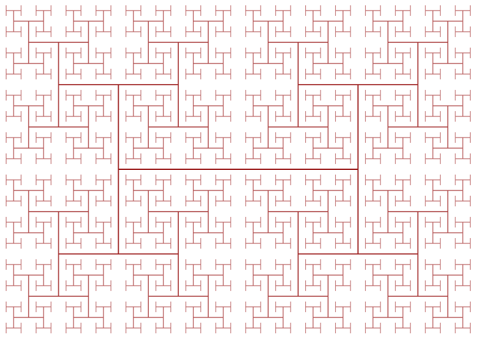

# HornedSphere
Create a 3D printable horned sphere based on the H-fractal

## H-fractal

## Idea
The goal is to make a horned sphere where each level corresponds to the next H-tree.
We need a shape that bifurcates from the valence 3 points of the H and goes to the two leave nodes opposite.
The paths cannot intersect with each other.

## Torus approach
Assuming a circle slanted at 45 degrees, and the valence 3 points at (+/-1,0,0),
then the two leaf nodes will be sqrt(2) apart and have coordinates (+/-1, +/-sqrt(2)/2, 2).
Rotate this down to the plane to and use the three points to compute the circle radius.
The point triple should be (-1,0) and (2*sqrt(2)-1, +/-sqrt(2)/2).
This is a circle of radius 3/2, centered at (1/2, 0).

The the distance between the H points decreases by sqrt(2) each iteration, the arm-radius of the torus should also decrease by this amount each iteration.

## Nonintersecting arms
If we rotate the tori to not intersect around their base point, the sides of the H remain parallel, but the connecting line is no longer perpendicular.
This may lead to an interesting shape when iterated.
One advantage of this approach is that the angle of attack should remain constant.

If we try to map exactly to the H-tree positions, the arms have to go around each other in some way.
One way to do this is to have right arms go high and left arms go low to the midpoint and then switch.
This has the advantage of not twisting the H-tree at each level, but the angle of attack varies.

There might be a nice constanct angle of attack approach that goes to a rotated (and not skewed) H-tree at the next level.
